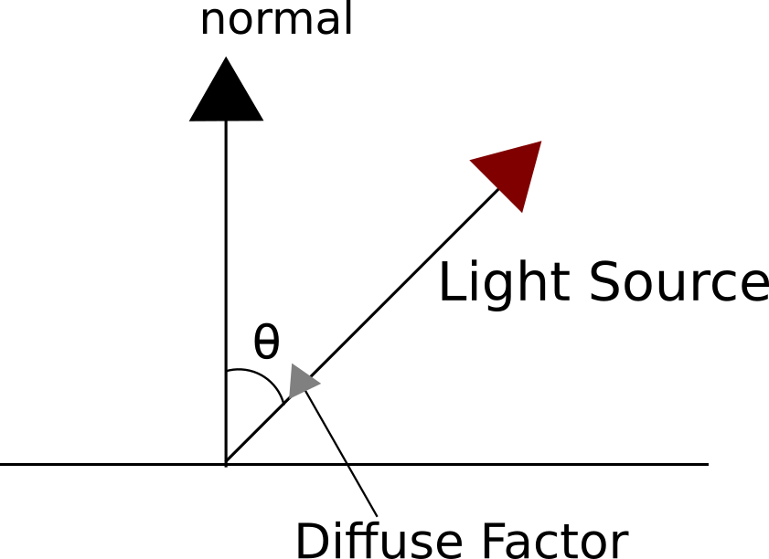
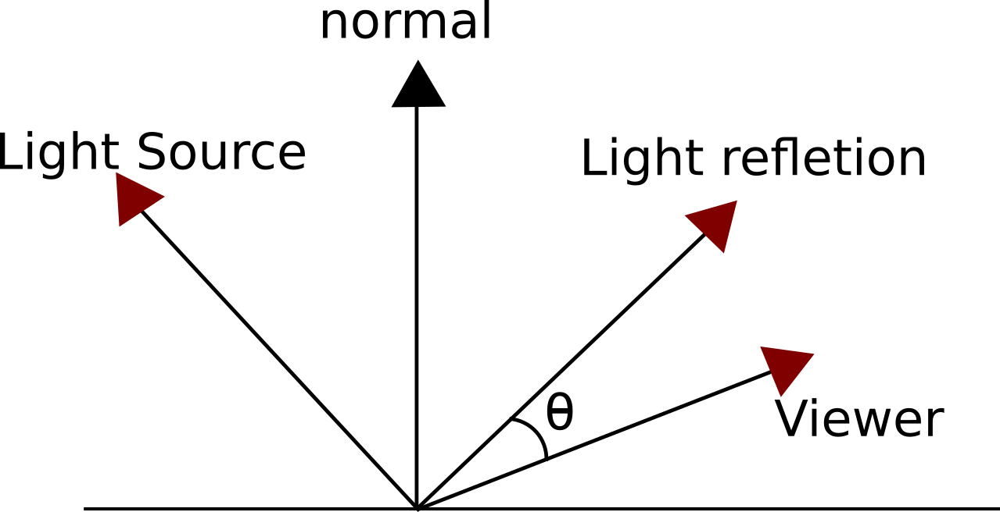
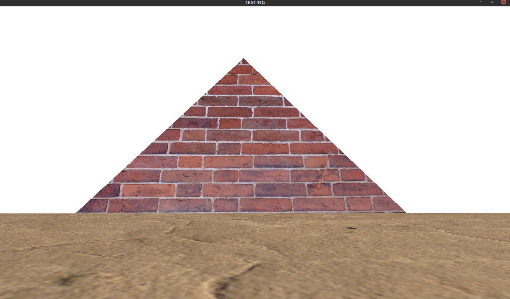
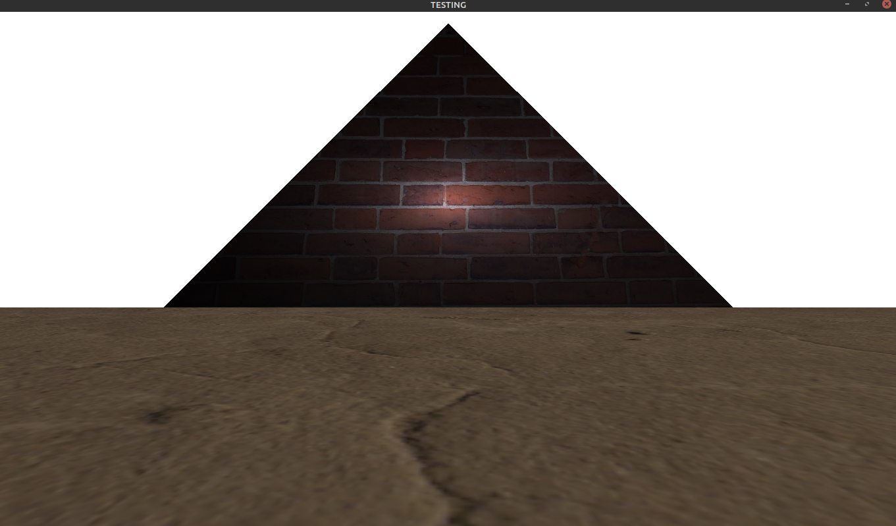
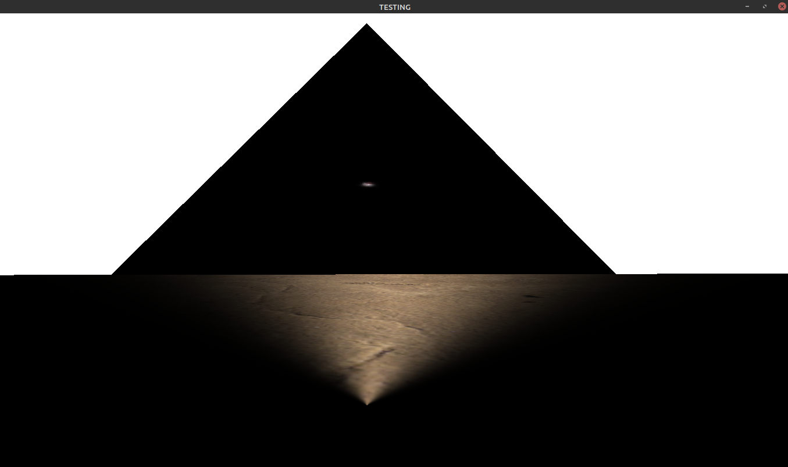
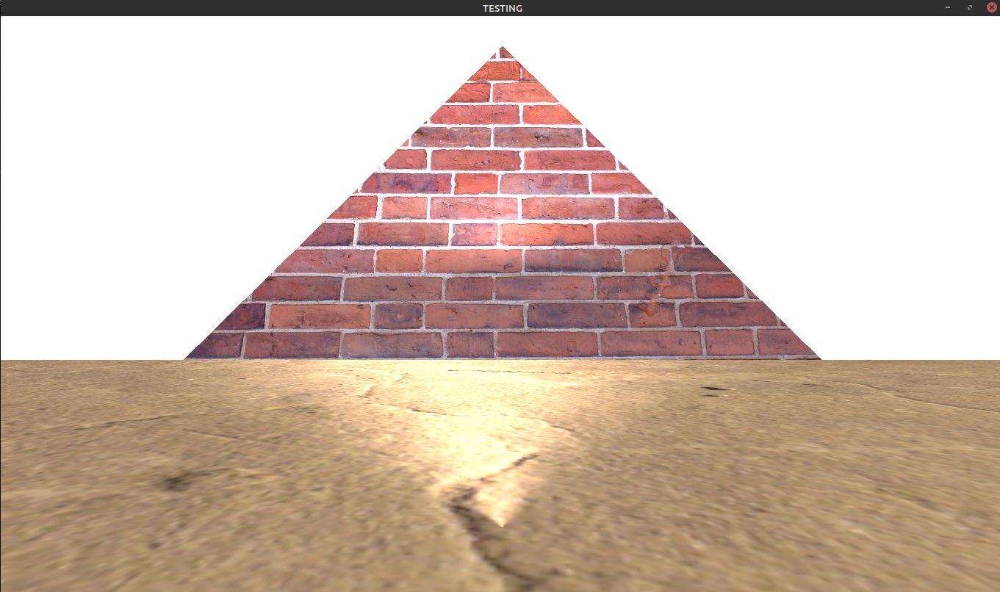

# PHONG LIGHTING MODEL USING OPENGL
---

[Goto Website](https://phongmodel.herokuapp.com/)
---

## Description
Simulation of Phong Lighting Model with directional light using OpenGL in C++.  

### What is OpenGL?
OpenGL is a cross-platform open source graphics API for rendering 2D/3D graphics.
It uses GPU for rendering an image onto the screen. It is vendor specific i.e. the implenentation of
this API for nvidia, amd, intel or any other GPU manufacturer will be different.  

For an image to render on the screen, it must go through stages of **rendering pipeline**:
* **Vertex specification**  
    uses VAOs and VBOs for holding the vertices and defining their data.

* **Vertex Shader (Programmable)**  
    Handles vertices indivisually and is used to pass on the vertices and their data to the GPU.
  
* **Tesselation (Programmable)**  

    To split up the data into smaller primitives.
* **Geometry Shaders (Programmable)**
    Handles primitives indivisually, and can alter the data provided to it.
* **Vertex Post-Processing**
    To save the results of vertex and geometry shaders for later use.

* **Clipping**
    To clip the object inside the window(cutting-off extra area).
* **Primitive Assembly**
    Vertices are converted into primitvives and removal of those primitives which can’t be seen on the screen.
* **Rasterization**
    Converts primitives into fragments(data of pixels) and responsible for performing interpolation.

* **Fragment Shader (Programmable)**
    Handles data of each fragment, and outputs the color of the fragment.  

### What is Phong Lighting Model?
**This model consists of 3 parts:**

* **Ambient Lighting**
    Light that is always present even if source direct path is blocked(no sense of direction).  

    `ambient = light color * ambient intensity`
    `fragment color = object color * ambient`

    basically the intensity of light and the type of light makes up the ambient light.

* **Diffuse Lighting**
    Light determined by direction of light source. (Ambient Light with notion of direction).

    

    `diffuse= light color * diffuse intensity * diffuse factor`  

    `fragment color = object color * (ambient + diffuse)`

* **Specular Lighting**
    Light which is reflected perfectly from source to viewer’s eyes.(shininess in objects).

    

    `specular = light color * specular intensity * specular factor`  

    `fragment color = object color * (ambient + diffuse + specualar)`

### Technology 
* C++
* OpenGL

### Dependencies
* [**GLEW(OpenGL extension wrangler)** – for support of versions 1.1 or above](glew.sourceforge.net)
* [**GLFW** – for window creation and input handling](https://www.glfw.org)
* [**GLM(Math library)** – for operations on vectors and matrices](https://glm.g-truc.net/0.9.9/index.html)
* [**stbi_image.h** – for loading the image as a byte type for textures](https://github.com/nothings/stb/blob/master/stb_image.h)

---

## Usage

### Commands

* To run the program
    ```
    make run
    ```

* To clean the object file
    ```
    make clean
    ```

### Key Mapping
* **Move** = [**&#8593; / &#8595; / &#8592; / &#8594;**]
* **Color** = [**R/G/B** + **+/-**]
* **AmbientIntensity** = [**A** + **+/-**]
* **DiffuseIntensity** = [**D** + **+/-**]
* **Direction** = [**X/Y/Z** + **+/-**]
* **Reset** = [**R**]

### Sample
* Only Ambient Lighting with full intensity
    <p align="center">
    
    </p>
* Only Diffuse Lighting with full intensity
    <p align="center">
    
    </p>
* Only Specular Lighting with full intensity
    <p align="center">
    
    </p>
* Phong Lighting Model
    <p align="center">
    
    </p>

---

## License
Licensed under [MIT License](license)
